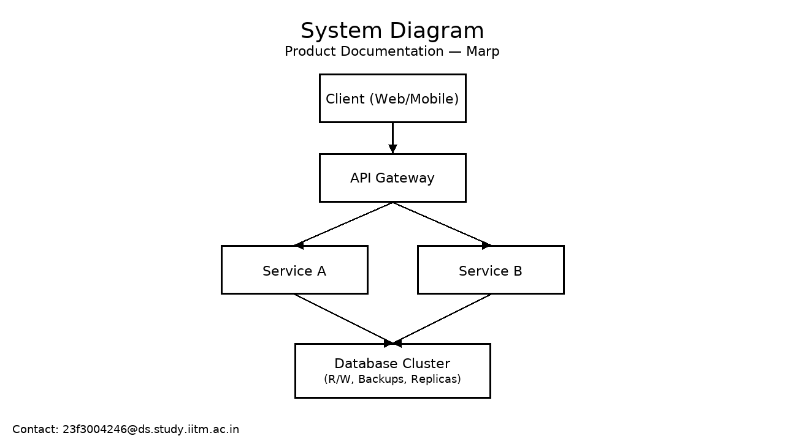

<!-- _header: Product Docs | v1.0 -->
<!-- _footer: 23f3004246@ds.study.iitm.ac.in -->

# Product Documentation

**Contact:** 23f3004246@ds.study.iitm.ac.in  
This deck demonstrates Marp features for maintainable, version-controlled documentation.

---



# System Overview

- Services, APIs, and data flows
- Deployment regions and SLAs
- AuthN/AuthZ boundaries

---

<!-- _class: lead -->

# Performance & Complexity

Inline: $O(n \log n)$

$$
T(n) = a\,n\log n + b\,n + c
$$

Notes:
- Use amortized analysis for queue-heavy paths
- Profile I/O wait vs CPU-bound stages

---

<!-- _color: #005f99 -->

## Styling via Directives

- Custom slide colors via `_color`
- Header/footer with email for verification
- Page numbers enabled via `paginate: true`

---

## Code Sample

```python
def service_latency(p50, p95):
    return {"p50_ms": p50, "p95_ms": p95}

print(service_latency(120, 380))
